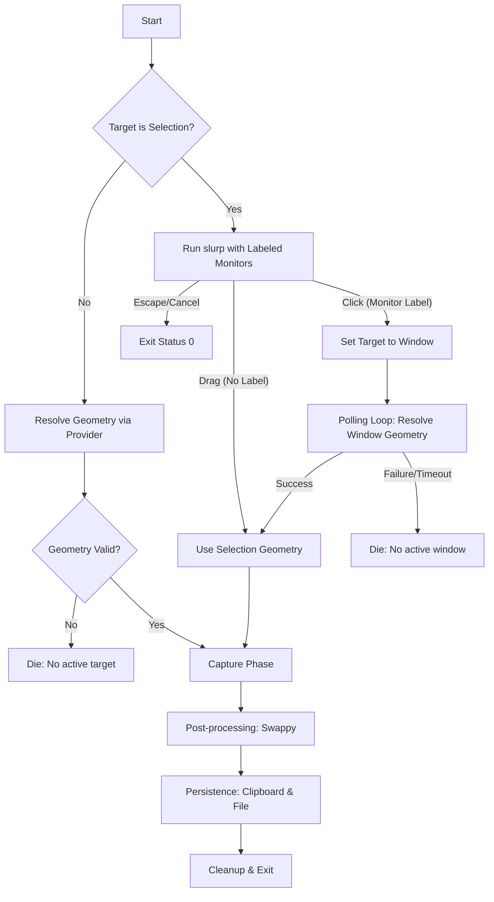

# Grimshot Execution Flow

This document details the decision logic used by `grimshot` to resolve targets and geometries, especially focusing on the selection-to-window fallback and cancellation semantics.

## Logic Overview

## Key Semantic Distinctions

1.  **Cancellation (Escape):**
    *   Detected via `slurp` exiting with status 1 and emitting "selection cancelled" to stderr.
    *   The script aborts immediately without notifications or fallback.

2.  **Point Selection (Fallback):**
    *   Detected via `slurp -p` output (e.g., `1x1` geometry or bare `x,y`).
    *   The script explicitly changes the `TARGET` state to `window`.
    *   It enters a **Polling Loop** (15 attempts, 20ms delay) to allow the compositor to restore focus after `slurp` exits.

3.  **Compositor Providers:**
    *   Each compositor (Hyprland, Sway, Niri) has a specialized geometry provider.
    *   `get_geometry` is pure and returns raw geometry strings or non-zero on tool failure.
